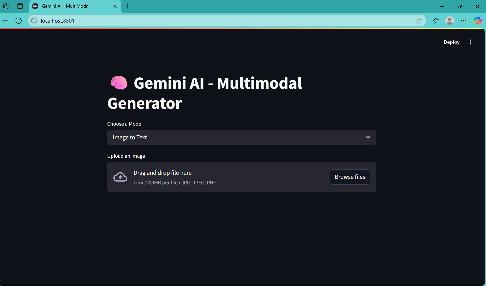

# 🧠 Gemini AI - Multimodal Generator (Text + Image)

This is a multimodal AI web app built with **Streamlit** and powered by **Google's Gemini 2.5 API**, enabling both **text-to-text** and **image-to-text** generation.

---

## 🔧 Features

- 🤖 **Text Generation**: Enter a prompt and receive intelligent, contextual completions using Gemini's LLM capabilities.
- 🖼️ **Image Captioning**: Upload an image and get a detailed description using Gemini's vision model.
- ⚡ **Updated UI**: Clean and intuitive layout with improved user experience.
- 🌐 Built with **Streamlit** for responsive, real-time interaction.
- 🧠 Powered by **Google Generative AI** (LLM + Vision multimodal models).

---

## 🛠️ Tech Stack

- Python
- Streamlit
- Google Generative AI (Gemini 2.5)
- PIL (Python Imaging Library)

---

## 📌 Use Cases

- Natural Language Text Completion
- Image Understanding / Caption Generation
- AI Demos and Multimodal Prototypes

---

## 📸 Preview

  

