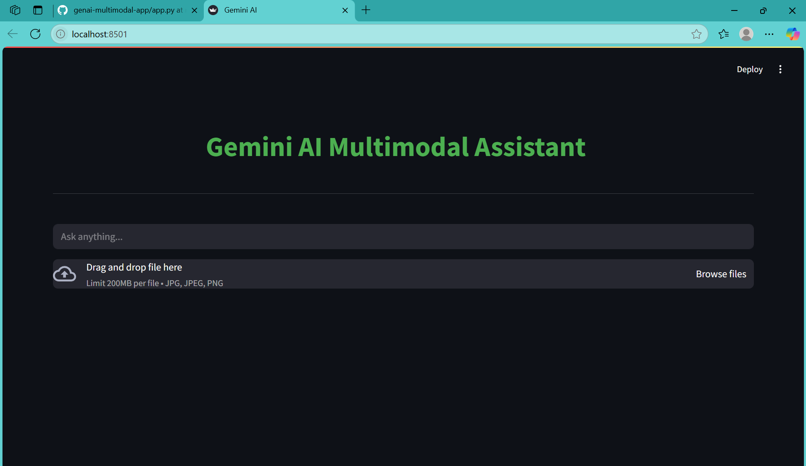

# 🧠 Gemini AI - Multimodal Generator (Text + Image)

This is a multimodal AI web app built with **Streamlit** and powered by **Google's Gemini 2.5 API**, enabling both **text-to-text** and **image-to-text** generation.

## 🔧 Features
- 🤖 **Text Generation**: Enter a prompt and get intelligent, contextual completions.
- 🖼️ **Image Captioning**: Upload an image to receive a detailed description using Gemini's vision capabilities.
- 🌐 Built with **Streamlit** for real-time interactive UI.
- 🧠 Powered by **Generative AI (LLMs + Vision)** from Google.

## 🛠️ Tech Stack
- Python
- Streamlit
- Google Generative AI (Gemini)
- PIL (Python Imaging Library)

## 📌 Use Cases
- NLP Text Completion
- Image Understanding / Caption Generation
- Multimodal AI Demos and Prototyping

## 📸 Preview

